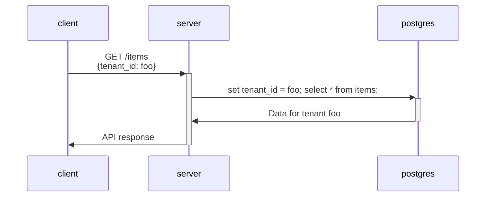

# Multi-tenant data isolation in PostgreSQL

Blog post: https://dctalbot.nyc/blog/pg-tenant-isolation/

This repo demonstrates a postgres-native approach to tenant isolation in a basic multi-tenant web app. Python, [Starlette](https://www.starlette.io/), and [SQLAlchemy](https://www.sqlalchemy.org/) are used here, but the technique can be implemented with comparable alternatives.

With this technique, developers can write SQL queries and have the result set automatically filtered to only include data belonging to a given tenant. The tenant is identified by a required runtime configuration parameter on the database session. The value of this parameter is typically sourced from an auth token in the initial client request.

This obviates the overhead of managing tenant-specific tables, schemas, or databases. Of course, if an extreme level of isolation is required, you may consider these options, plus the option of running distinct instances of your application.



## Getting Started

This project is lightweight and should not be a hassle to set up or tear down for most developers.

Requirements:

- Python 3.9 +
- Docker 24 +

Run the following `make` targets, or run the commands in the [Makefile](./Makefile) manually.

1. Ensure `python` is at least the version specified above.

```
python --version
```

2. Install Python dependencies in a [virtual environment](https://docs.python.org/3/library/venv.html)

```
make venv
```

3. Make sure Docker is running, and run the following command to start a local Postgres server. The [init.sql](./init.sql) script will run automatically, configuring the row security policies and inserting seed data. If you already have a process running on port 5432, you will need to stop that process first.

```
make pg
```

4. Start the web server

```
make start
```

At this point, you can make some web requests. I'm using `curl` and `jq`, but you can use the web client of your choice.

The options for `X-tenant-id` are:

- `7a245486-3fc8-47ec-b303-04fefe7a58ff`
- `162be16f-f76d-431a-a213-171838ded9ae`
- `ebdba44d-ad48-4e73-9bd5-339e3c3fc590`

### Example 1: List all Items

```console
curl --header "X-tenant-id: 7a245486-3fc8-47ec-b303-04fefe7a58ff" http://127.0.0.1:8000/items/ | jq
```

This results in the following query:

```sql
SET app.current_tenant_id = '7a245486-3fc8-47ec-b303-04fefe7a58ff'; SELECT * FROM items;
```

The row security policy on the `items` table filters out rows which do not belong to `app.current_tenant_id`. Thus, we receive only the following items in the API response:

```json
[
  {
    "id": "997d0bee-351f-4b09-9dd3-2289da1ce0ba",
    "title": "art-fair",
    "tenant_id": "7a245486-3fc8-47ec-b303-04fefe7a58ff"
  },
  {
    "id": "bab62059-b702-442e-a053-7e4690d5510b",
    "title": "bench",
    "tenant_id": "7a245486-3fc8-47ec-b303-04fefe7a58ff"
  },
  {
    "id": "1bfa0393-0f74-4824-b234-052e49511a5c",
    "title": "concert",
    "tenant_id": "7a245486-3fc8-47ec-b303-04fefe7a58ff"
  },
  {
    "id": "1b94d748-6241-410c-95f5-015105316f27",
    "title": "drinking-fountain",
    "tenant_id": "7a245486-3fc8-47ec-b303-04fefe7a58ff"
  },
  {
    "id": "de5de5ab-abdd-499a-95a6-00f8c7b7130a",
    "title": "emergency-kit",
    "tenant_id": "7a245486-3fc8-47ec-b303-04fefe7a58ff"
  }
]
```

### Example 2: List all Tenants

```console
curl --header "X-tenant-id: 7a245486-3fc8-47ec-b303-04fefe7a58ff" http://127.0.0.1:8000/tenants/ | jq
```

This results in the following query:

```sql
SET app.current_tenant_id = '7a245486-3fc8-47ec-b303-04fefe7a58ff'; SELECT tenants.*, items.* FROM tenants LEFT OUTER JOIN items ON tenants.id = items.tenant_id;
```

The row security policies on the `items` and `tenants` tables filter out rows which do not belong to `app.current_tenant_id`. Thus, we receive only the following items in the API response:

```json
[
  {
    "id": "7a245486-3fc8-47ec-b303-04fefe7a58ff",
    "name": "pawnee-parks-and-rec",
    "items": [
      {
        "id": "997d0bee-351f-4b09-9dd3-2289da1ce0ba",
        "title": "art-fair",
        "tenant_id": "7a245486-3fc8-47ec-b303-04fefe7a58ff"
      },
      {
        "id": "bab62059-b702-442e-a053-7e4690d5510b",
        "title": "bench",
        "tenant_id": "7a245486-3fc8-47ec-b303-04fefe7a58ff"
      },
      {
        "id": "1bfa0393-0f74-4824-b234-052e49511a5c",
        "title": "concert",
        "tenant_id": "7a245486-3fc8-47ec-b303-04fefe7a58ff"
      },
      {
        "id": "1b94d748-6241-410c-95f5-015105316f27",
        "title": "drinking-fountain",
        "tenant_id": "7a245486-3fc8-47ec-b303-04fefe7a58ff"
      },
      {
        "id": "de5de5ab-abdd-499a-95a6-00f8c7b7130a",
        "title": "emergency-kit",
        "tenant_id": "7a245486-3fc8-47ec-b303-04fefe7a58ff"
      }
    ]
  }
]
```

## Tear down

When you're done, you can clean up the resources with the following command:

```
make clean
```
